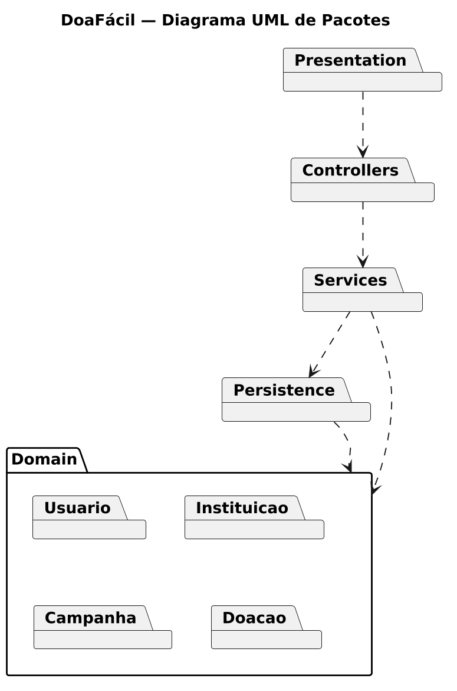
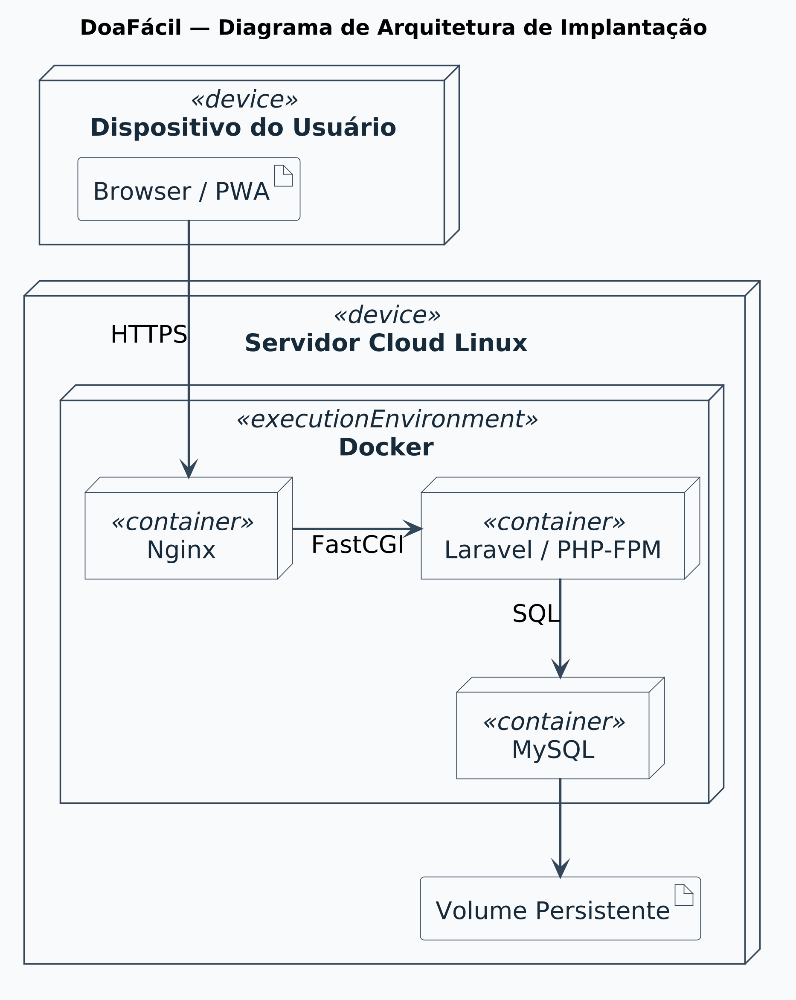
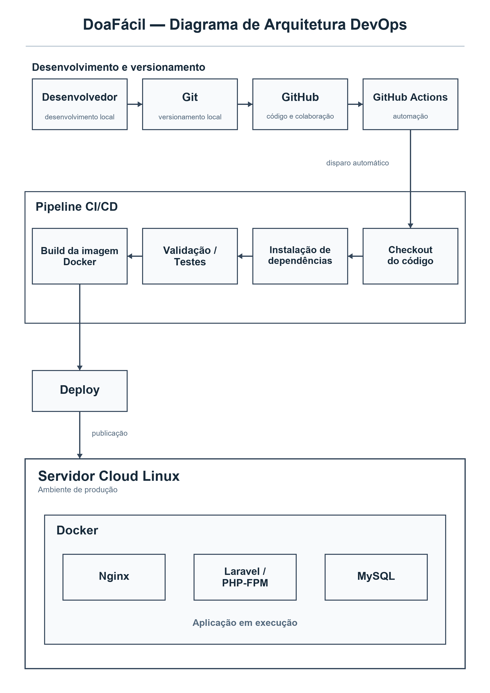

# DoaFácil

## Sobre o projeto

O DoaFácil é uma aplicação web progressiva (PWA) destinada a aproximar instituições sociais de pessoas interessadas em realizar doações. A plataforma permitirá que as instituições divulguem suas campanhas e necessidades, facilitando o acesso da comunidade a essas informações.

## Problema

Instituições sociais frequentemente enfrentam dificuldades para divulgar suas necessidades e campanhas de arrecadação de forma centralizada. Ao mesmo tempo, muitas pessoas desejam ajudar, mas não sabem quais instituições precisam de auxílio ou quais itens estão sendo solicitados.

## Objetivo

O objetivo do projeto é centralizar campanhas de arrecadação e facilitar o registro e o acompanhamento de doações, promovendo uma comunicação mais eficiente entre instituições sociais e potenciais doadores.

## Funcionalidades previstas

- Cadastro e autenticação de usuários;
- Cadastro de instituições;
- Criação de campanhas de arrecadação;
- Consulta de campanhas disponíveis;
- Registro de doações;
- Confirmação de recebimento de doações;
- Acompanhamento do status das campanhas.

## Tecnologias previstas

- PHP
- Laravel
- MySQL
- HTML
- CSS
- JavaScript
- PWA
- Docker
- Nginx
- GitHub Actions

## Arquitetura

A documentação de arquitetura do projeto ficará localizada no diretório `docs/`. Serão produzidos os seguintes artefatos:

- [Diagrama UML de Pacotes](docs/diagramas/uml-pacotes.png);
- [Diagrama de Arquitetura de Implantação](docs/diagramas/implantacao.png);
- [Diagrama de Arquitetura DevOps](docs/diagramas/devops.png);
- [Documentação da infraestrutura de deploy](docs/infraestrutura/infraestrutura-deploy.md).



### Diagrama de Arquitetura de Implantação



## Diagrama de Arquitetura DevOps



## Estrutura do repositório

```text
doafacil/
├── README.md
└── docs/
    ├── diagramas/
    │   ├── .gitkeep
    │   ├── devops.png
    │   ├── implantacao.png
    │   └── uml-pacotes.png
    └── infraestrutura/
        ├── .gitkeep
        └── infraestrutura-deploy.md
```

## Integrantes

- Arthur
- [Adicionar integrante]

## Disciplina

Prática Extensionista IV
